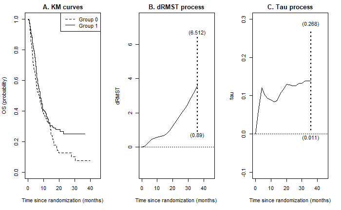

## Tau-Process for Nonproportional Hazards Scenario
In immunotherapy trials, survival curves for treated and control groups often exhibit delayed separation or crossing due to the human immune response. This phenomenon violates the traditional proportional hazards assumption in survival analysis, significantly reducing the power of standard testing procedures like the (weighted) log-rank test. Additionally, an addendum proposed by ICH suggests using an <a href="https://www.ema.europa.eu/en/ich-e9-statistical-principles-clinical-trials-scientific-guideline" target="_blank"> estimand framework </a> to report and interpret clinical trial results. Under nonproportional hazards, the commonly reported hazard ratio becomes meaningless. <a href=" http://www.oncoestimand.org" target="_blank"> Clinicians and biostatisticians in the pharmaceutical industry </a> are discussing a shift towards more interpretable treatment measures compared to the hazard ratio, log-rank test, and Cox model, in line with ICH guidance. We have proposed a novel approach for defining an interpretable estimand and developing the corresponding inference procedures. This methodology introduces a graphical Kendall's tau plot, effectively illustrating the relative performances of the two groups over time. The plot serves as an interpretable estimand for describing treatment effects and is advantageous because it is free of model assumptions and robust to censoring mechanisms.  

	

## Tau-Process with Long-Term Survivors

## Covariate Adjustment with Efficiency Gain Guarantee
In 2023, the U.S. Food and Drug Administration (FDA) issued guidance titled <a href="https://www.fda.gov/regulatory-information/search-fda-guidance-documents/adjusting-covariates-randomized-clinical-trials-drugs-and-biological-products" target="_blank"> "Adjustment for Covariates in Randomized Clinical Trials for Drugs and Biological Products </a>." This guidance recommends using prognostic baseline covariates to enhance the efficiency of estimating and testing marginal estimands. Traditionally, the practice involves selecting a "suitable" model and reporting the corresponding coefficients, whose meanings depend on the chosen model. However, no model is perfect, and this can lead to significant bias and misleading interpretations. Alternatively, by deriving the efficient influence function of the target estimand within a nonparametric model, machine learning techniques can be employed to approximate this function, enabling valid statistical inference. Approaches such as Targeted Learning and Double/Debiased Machine Learning are based on this rationale. This framework shifts statistical methodology from a model-based approach to an estimand-oriented approach, effectively addressing the scientific questions of interest.